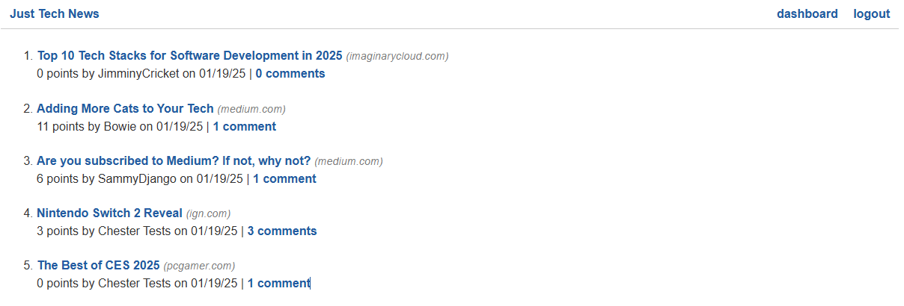
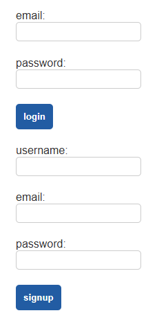
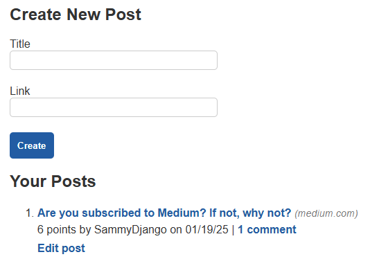
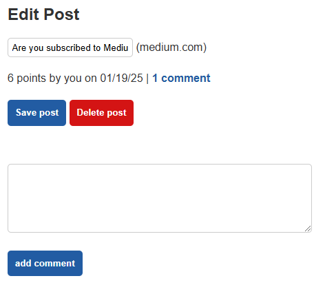
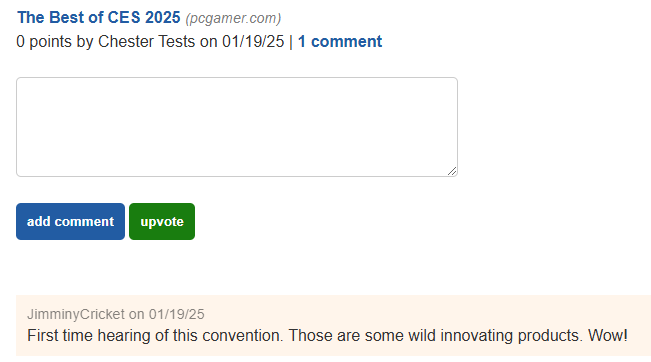

# Tech News Feed

## Description

A simple news feed where users can post links to tech related articles.  Users can view other articles that are posted, as well as, provide comments and upvotes.  The application is powered by a Python web server using a Flask framework, a MySQL database, and Jinja as the frontend templating engine.  Other features include: user logins and sessions, protected routes, and the ability to update and delete posts.

[Click here](https://python-newsfeed-7lbt.onrender.com/) to visit the deployed application.

NOTE: This application is hosted on the [Render: Cloud Application Platform](https://render.com/) using a free tier.  The browser page may hang for up to a minute as the service spins back up.  See [Render's documentation](https://render.com/docs/free#spinning-down-on-idle) for more info.

## Table of Contents

- [Usage](#usage)
- [Installation](#installation)
- [License](#license)
- [Questions](#questions)

## Usage

[Deployed Application](https://python-newsfeed-7lbt.onrender.com/)

[Code Repository](https://github.com/briandwach/python-newsfeed)

### Home Page

All posted articles are accessible from the home page.  The most recent articles will be featured at the top.  Click the article titles to open the articles in a new tab or click the comments to view user posted responses.  Without logging in you will not be able to add a comment or upvote an article.  Clicking the "Just Tech News" header at the top left will always redirect you to the home page.

### Login/Signup

1. After clicking "login" at the top right of the web application, you will be viewing the below login and signup forms.

2. If you have not previously signed up, provide a username, valid email, and password (password must be more than 4 characters). 

3. If you have already signed up, simply provide your username and password and click login.

### Dashboard

Once logged in, you will be redirected to your dashboard.  From here you can view your previous posts or create a new post.  To create a new post, provide a title and link to the article (title and link must not exceed 100 characters).

Click on "Edit post" below a previous post if you'd like to change the title of your post.  After editing the title click "Save post".  You also have the option to delete a post or add a comment.

### Adding Comments and Upvotes

When viewing the commments for a post you can add a new comment by typing in the text box and the clicking the "add comment" button.  Your comment will be added to the comments below. 

To upvote a post, simply click the "upvote" button and you will see the total upvotes for that post increase.

## Installation

(The following steps are for PC only)

1. Ensure you have the latest version of Python installed, as well as, a MySQL database running on your machine.

2. Clone the repository using Git.

3. In the root directory of the project, use a Git Bash terminal to create a Python virtual environment by running the following command: `python -m venv venv`

4. Then activate the virtual environment by running this command: `source venv/Scripts/activate`

5. You are ready to install the project dependencies.  Next run this command: `pip install -r requirements.txt`

6. Last step is to create a .env file in the root directory of your project with an environment variable called DB_URL.  The URL will point to your MySQL instance on your machine. The content of your .env file should look like this: `DB_URL=mysql+pymysql://root:<YOUR PASSWORD HERE>@localhost/python_news_db`  

7. You are ready to run the application on your machine.  Run the following command in the root directory of your project: `python -m flask run`

8. The application will now be running on http://127.0.0.1:5000.

## License

This application is covered under the [MIT License](http://choosealicense.com/licenses/mit/).

## Questions
Please email me with any questions regarding this application at: brian.d.wach@gmail.com

Additionally, check out more of my work on GitHub: [briandwach](https://github.com/briandwach)